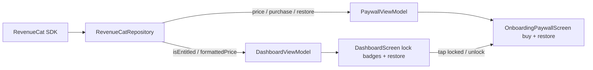

# One-time unlock payments

Integrate RevenueCat so a single one-time purchase unlocks every non-free `TopicCategory`. Entitlement source of truth is RevenueCat's `CustomerInfo` (the SDK caches it locally for offline/instant reads, so no custom `SharedPreferences` flag). The `$29.99` copy becomes a live price from the offering's `StoreProduct.price.formatted`, with `$29.99` as offline fallback. 3 PRs.



Non-code prerequisites (cannot be done in code, must exist before testing purchases):
- Create a RevenueCat project and add Google Play Service Credentials.
- Create a managed one-time product `all_scenarios_unlock` in Play Console.
- In RevenueCat: create entitlement id `all_scenarios`, attach the product, add it to the current Offering.
- Copy the RevenueCat Android (Google) public SDK key into the app config (see PR 1).
- Test with a signed build and a Play license tester.

---

## PR 1: RevenueCat layer + DI

Foundation: adds the RevenueCat SDK, configures it once in the Application, adds a thin repository exposing entitlement/price/purchase state, and wires it into `AppContainer`. Independent; merge first.

**Files (5):**
- `gradle/libs.versions.toml` - add RevenueCat version + library alias
- `app/build.gradle.kts` - add RevenueCat dependency + `buildConfigField` for the API key
- `app/src/main/java/com/example/localllmvoice/SoloTalkApplication.kt` - configure RevenueCat on startup
- `app/src/main/java/com/example/localllmvoice/data/purchase/RevenueCatRepository.kt` - new RevenueCat wrapper
- `app/src/main/java/com/example/localllmvoice/di/AppContainer.kt` - wire new dep

**libs.versions.toml changes (~2 lines):**
- Under `[versions]`: `revenuecat = "8.10.0"` (verify latest stable before merge).
- Under `[libraries]`: `revenuecat-purchases = { group = "com.revenuecat.purchases", name = "purchases", version.ref = "revenuecat" }`

**app/build.gradle.kts changes (~4 lines):**
- In `dependencies { }` add `implementation(libs.revenuecat.purchases)`.
- Enable BuildConfig + expose the key (public SDK key, safe to embed):
```kotlin
android {
    buildFeatures { buildConfig = true }
    defaultConfig {
        buildConfigField("String", "REVENUECAT_API_KEY", "\"goog_REPLACE_ME\"")
    }
}
```
- No manifest edit: the RevenueCat SDK merges the `com.android.vending.BILLING` permission.
- Do NOT hardcode the key inside a Kotlin source constant; read it from `BuildConfig.REVENUECAT_API_KEY`.

**SoloTalkApplication changes (~6 lines):**
- In `onCreate()`, BEFORE constructing `AppContainer`, configure the SDK once:
```kotlin
if (BuildConfig.DEBUG) Purchases.logLevel = LogLevel.DEBUG
Purchases.configure(
    PurchasesConfiguration.Builder(this, BuildConfig.REVENUECAT_API_KEY).build()
)
```

**RevenueCatRepository changes (~150 lines):**
- Constructor `RevenueCatRepository()` — uses the `Purchases.sharedInstance` singleton (configured in the Application). Owns an application-scoped `CoroutineScope(SupervisorJob() + Dispatchers.Main)` (RevenueCat callbacks are main-thread friendly).
- Constants: `const val ENTITLEMENT_ID = "all_scenarios"`; `const val FALLBACK_PRICE = "$29.99"`.
- Public state:
  - `val isEntitled: StateFlow<Boolean>` (MutableStateFlow, default false)
  - `val formattedPrice: StateFlow<String?>` (null until offerings load; UI falls back to `FALLBACK_PRICE`)
  - `val purchaseState: StateFlow<PurchaseState>` where `sealed interface PurchaseState { object Idle; object Pending; object Success; data class Failed(val message: String) }`
- Cache the selected `com.revenuecat.purchases.Package` for the purchase flow (private `var fullLibraryPackage: Package?`).
- `fun start()`:
  - Register `Purchases.sharedInstance.updatedCustomerInfoListener = UpdatedCustomerInfoListener { info -> updateEntitlement(info) }`.
  - Launch a coroutine to `awaitCustomerInfo()` (initial entitlement) and `awaitOfferings()` (price + package).
- `private fun updateEntitlement(info: CustomerInfo)`: `_isEntitled.value = info.entitlements[ENTITLEMENT_ID]?.isActive == true`.
- From offerings: `fullLibraryPackage = offerings.current?.availablePackages?.firstOrNull()`; set `_formattedPrice.value = fullLibraryPackage?.product?.price?.formatted`.
- `suspend fun purchase(activity: Activity)`:
  - Set `purchaseState = Pending`.
  - `val pkg = fullLibraryPackage ?: return (set Failed("Store unavailable"))`.
  - Call `Purchases.sharedInstance.awaitPurchase(PurchaseParams.Builder(activity, pkg).build())`; on result `updateEntitlement(result.customerInfo)` then `purchaseState = Success`.
  - Wrap in try/catch for `PurchasesException`: if `userCancelled` set `purchaseState = Idle`, else `Failed(message)`.
- `suspend fun restore()`: `val info = Purchases.sharedInstance.awaitRestore(); updateEntitlement(info)`. Catch `PurchasesException` -> `Failed`.
- The coroutine `await*` extensions require `@OptIn(ExperimentalPreviewRevenueCatPurchasesAPI::class)` on the relevant functions — add it.
- Do NOT add a custom `SharedPreferences` entitlement flag: RevenueCat already caches `CustomerInfo` for offline reads.

**AppContainer changes (~3 lines):**
- Add `val purchaseRepository = RevenueCatRepository()`
- In `init { }` add `purchaseRepository.start()`

**Acceptance criteria:**
- [ ] Project builds with the RevenueCat dependency resolved and `BuildConfig.REVENUECAT_API_KEY` available.
- [ ] `AppContainer.purchaseRepository` exposes `isEntitled`, `formattedPrice`, `purchaseState`.
- [ ] On launch, an account that owns the entitlement flips `isEntitled` to true via `awaitCustomerInfo`/listener (no UI yet).

**Estimated total: ~165 lines, 5 files**

---

## PR 2: Functional paywall screen + ViewModel + routing

Turns `OnboardingPaywallScreen` into a real buy screen reused in both onboarding and a new standalone dashboard route, with live price + restore. Depends on PR 1.

**Files (5):**
- `app/src/main/java/com/example/localllmvoice/util/ActivityExt.kt` - new `Context.findActivity()` helper
- `app/src/main/java/com/example/localllmvoice/ui/onboarding/PaywallViewModel.kt` - new VM wrapping `RevenueCatRepository`
- `app/src/main/java/com/example/localllmvoice/ui/onboarding/OnboardingPaywallScreen.kt` - rewrite to buy/restore/live price
- `app/src/main/java/com/example/localllmvoice/navigation/ViewModelFactories.kt` - add `PaywallViewModelFactory`
- `app/src/main/java/com/example/localllmvoice/navigation/AppNavigation.kt` - add `Routes.PAYWALL` + rewire onboarding paywall

**ActivityExt changes (~12 lines):**
```kotlin
fun Context.findActivity(): Activity? {
    var ctx = this
    while (ctx is ContextWrapper) {
        if (ctx is Activity) return ctx
        ctx = ctx.baseContext
    }
    return null
}
```

**PaywallViewModel changes (~75 lines):**
- `class PaywallViewModel(private val purchaseRepository: RevenueCatRepository) : ViewModel()`
- `data class PaywallUiState(val priceText: String = "$29.99", val isPurchasing: Boolean = false, val isEntitled: Boolean = false, val errorMessage: String? = null)`
- Combine `purchaseRepository.formattedPrice` (fallback to `$29.99`), `isEntitled`, `purchaseState` into `uiState: StateFlow<PaywallUiState>` (map `purchaseState == Pending` -> `isPurchasing`, `Failed.message` -> `errorMessage`).
- `fun purchase(activity: Activity)` -> `viewModelScope.launch { purchaseRepository.purchase(activity) }`
- `fun restore()` -> `viewModelScope.launch { purchaseRepository.restore() }`

**OnboardingPaywallScreen changes (~120 lines):**
- New signature:
```kotlin
@Composable
fun OnboardingPaywallScreen(
    viewModel: PaywallViewModel,
    onPurchased: () -> Unit,
    onContinueFree: (() -> Unit)?, // null => dashboard "store" mode
    onClose: () -> Unit,
    modifier: Modifier = Modifier,
)
```
- Collect `uiState`. Build the body copy with the live `uiState.priceText` instead of the hardcoded `$29.99` literal.
- Get activity once: `val activity = LocalContext.current.findActivity()`.
- Buttons via existing `OnboardingPrimaryButton`:
  - Onboarding mode (`onContinueFree != null`): primary `OnboardingPrimaryButton("Get my free scenarios", onContinueFree)`; secondary buy button `"Unlock full library — ${uiState.priceText}"` -> `activity?.let(viewModel::purchase)`.
  - Dashboard mode (`onContinueFree == null`): primary buy button is the main CTA; add a back/close affordance calling `onClose`.
- A small text button `"Restore purchase"` -> `viewModel.restore()` in both modes.
- `LaunchedEffect(uiState.isEntitled) { if (uiState.isEntitled) onPurchased() }`.
- Disable buy button while `uiState.isPurchasing`; show `uiState.errorMessage` if present.
- Do NOT keep the hardcoded `$29.99` string in the body literal; only `PaywallUiState.priceText` default carries the fallback.

**ViewModelFactories changes (~15 lines):**
- Add `PaywallViewModelFactory(appContainer)` returning `PaywallViewModel(appContainer.purchaseRepository)`, matching the existing factory pattern.

**AppNavigation changes (~25 lines):**
- Add `const val PAYWALL = "paywall"` to `Routes`.
- Rewrite the `ONBOARDING_PAYWALL` composable to build a `PaywallViewModel` via factory and call `OnboardingPaywallScreen(viewModel, onPurchased = { navController.navigate(Routes.ONBOARDING_DOWNLOAD) }, onContinueFree = { navController.navigate(Routes.ONBOARDING_DOWNLOAD) }, onClose = {})`. Both paths proceed to download; entitlement persists regardless.
- Add a top-level `composable(Routes.PAYWALL)` (dashboard store mode): `OnboardingPaywallScreen(viewModel, onPurchased = { navController.popBackStack() }, onContinueFree = null, onClose = { navController.popBackStack() })`.

**Acceptance criteria:**
- [ ] Onboarding paywall shows the live RevenueCat price (or `$29.99` offline) and a working "Unlock" + "Restore" alongside "Get my free scenarios".
- [ ] Completing a test purchase from onboarding sets entitlement and proceeds to download.
- [ ] The standalone `paywall` route can be navigated to and dismissed.

**Estimated total: ~245 lines, 5 files**

---

## PR 3: Dashboard gating + restore entry

Locks paid categories behind the entitlement, adds lock badges that route to the paywall, and a Restore button in the free section. Depends on PR 1 (entitlement) and PR 2 (`Routes.PAYWALL`).

**Files (4):**
- `app/src/main/java/com/example/localllmvoice/ui/dashboard/DashboardUiState.kt` - add entitlement
- `app/src/main/java/com/example/localllmvoice/ui/dashboard/DashboardViewModel.kt` - observe entitlement + restore
- `app/src/main/java/com/example/localllmvoice/ui/dashboard/DashboardScreen.kt` - lock badges, restore, callbacks
- `app/src/main/java/com/example/localllmvoice/navigation/AppNavigation.kt` - pass dashboard callbacks

**DashboardUiState changes (~5 lines):**
- Add `val isEntitled: Boolean = false`.
- Add `fun isCategoryUnlocked(category: TopicCategory): Boolean = category.isFree || isEntitled`.

**DashboardViewModel changes (~15 lines):**
- In `init { }` add a collector: `viewModelScope.launch { appContainer.purchaseRepository.isEntitled.collect { entitled -> _uiState.update { it.copy(isEntitled = entitled) } } }`.
- Add `fun restorePurchases() { viewModelScope.launch { appContainer.purchaseRepository.restore() } }`.

**DashboardScreen changes (~60 lines):**
- `DashboardScreen` / `DashboardContent` gain params: `onUnlockRequested: () -> Unit`, `onRestore: () -> Unit` (keep existing `onTopicSelected`).
- In the category loop, compute `val unlocked = uiState.isCategoryUnlocked(category)` and pass `locked = !unlocked` to each `TopicCard`.
- `TopicCard` gains `locked: Boolean`:
  - When `locked`: card is always clickable; `onClick = onUnlockRequested`; trailing circle shows `Icons.Filled.Lock` instead of `ArrowForward`.
  - When not locked: existing behavior (`enabled = canStartConversation`, `onClick = onTopicSelected`).
- After the free category's topics, add a `"Restore purchase"` `TextButton` (only when `!uiState.isEntitled`) calling `onRestore`.
- State stays hoisted in the VM; no purchase logic in composables.

**AppNavigation changes (~5 lines):**
- In the `DASHBOARD` composable pass `onUnlockRequested = { navController.navigate(Routes.PAYWALL) }` and `onRestore = { viewModel.restorePurchases() }`.

**Acceptance criteria:**
- [ ] Before purchase: free category tappable; paid scenarios show a lock and open the paywall on tap.
- [ ] A "Restore purchase" action is visible in the free section while not entitled.
- [ ] After a successful purchase/restore, locks disappear and all scenarios behave like the free ones (gated only by model readiness).

**Estimated total: ~85 lines, 4 files**

---

## Out of scope (call out, don't build)
- No new Settings screen (restore lives on dashboard + paywall; RevenueCat also auto-syncs entitlement on launch).
- No RevenueCat-hosted Paywall UI (Paywalls v2): we reuse the existing native `OnboardingPaywallScreen` per the design decision. Revisit if you want remote-configurable paywalls.
- No per-topic gating: gating stays at `TopicCategory` level since `ConversationTopic` has no `isFree`.
