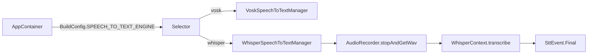

# Whisper STT engine

Add a whisper.cpp-backed `SpeechToTextEngine` (on-device, offline) and a `local.properties`-driven `BuildConfig.SPEECH_TO_TEXT_ENGINE` flag so the wired engine in `AppContainer` can be swapped between Vosk and Whisper between builds. 2 PRs. Constraints: reuse the existing `AudioRecorder.stopAndGetWav()` (Whisper is non-streaming, so no live word-by-word partials), reuse OkHttp for model download, download `ggml-tiny.bin` (multilingual, ~75 MB) at runtime, do NOT add NDK/CMake (the AAR ships prebuilt `.so` for arm64-v8a + x86_64).

## Key risks (acknowledged, not hidden)
- `mx.valdora:whisper-android:1.0.0` is brand new (Feb 2026), 0 stars, single contributor. Its exact API (`WhisperContext` constructor, `transcribe` signature, release method) MUST be verified against the resolved AAR during PR 1 and adjusted if it differs from the snippet below.
- The AAR only ships `arm64-v8a` and `x86_64`. It runs on physical arm64 devices and x86_64 emulators; it will crash on 32-bit/armeabi-v7a.
- Whisper has no streaming partials; the comparison against Vosk is inherently "live captions vs. transcribe-on-stop".



---

## PR 1: WhisperSpeechToTextManager + AAR dependency

Replaces the broken `WhisperSpeechToTextEngine` stub with a full `SpeechToTextEngine` implementation backed by the whisper.cpp AAR, and downloads `ggml-tiny.bin` at runtime. Independent; compiles on its own because the class fully implements the interface but is not yet wired into `AppContainer` (still defaults to Vosk until PR 2).

**Files (4):**
- `gradle/libs.versions.toml` - add whisper version + library entry
- `app/build.gradle.kts` - reference the library
- `app/src/main/java/com/example/localllmvoice/data/audio/WhisperSpeechToTextManager.kt` - new full implementation
- `app/src/main/java/com/example/localllmvoice/data/audio/WhisperSpeechToTextEngine.kt` - delete the non-compiling stub

**libs.versions.toml changes (~2 lines):**
- Under `[versions]` add: `whisper = "1.0.0"`
- Under `[libraries]` add:

```toml
whisper-android = { group = "mx.valdora", name = "whisper-android", version.ref = "whisper" }
```

**app/build.gradle.kts changes (~1 line):**
- In `dependencies { }` add: `implementation(libs.whisper.android)`
- Verify `mavenCentral()` is present in `settings.gradle.kts` `dependencyResolutionManagement`. If the artifact does not resolve from Maven Central, the fallback is to clone `gouh/whisper-android` and `./gradlew :library:publishToMavenLocal` (add `mavenLocal()`); do NOT silently switch to vendoring NDK source without flagging it.

**WhisperSpeechToTextManager changes (~160 lines):**
- `class WhisperSpeechToTextManager(private val context: Context) : SpeechToTextEngine` in package `com.example.localllmvoice.data.audio`.
- Fields: `private val audioRecorder = AudioRecorder(context)`; an `OkHttpClient` (60s timeouts, mirror `MoonshineSpeechToTextManager`); `private val modelFile = File(context.filesDir, "whisper/ggml-tiny.bin")`; `private var whisperContext: WhisperContext? = null`; `private var onStopRequested: (() -> Unit)? = null`.
- `hasRecordPermission()` delegates to `audioRecorder.hasRecordPermission()`. `isAvailable()` returns `true`.
- `transcribe(languageTag: String): Flow<SttEvent> = callbackFlow { ... }` mirroring the structure of `VoskSpeechToTextManager.transcribe`:
  - permission guard -> `SttEvent.Failure` + `close()`.
  - if `!isModelReady()`, collect `downloadModel()` emitting `SttEvent.Partial("Downloading Whisper model ($progress%)…")`; on exception emit `Failure` + close.
  - `ensureModelLoaded()` in try/catch -> `Failure` on load error.
  - `onStopRequested = { launch { trySend(SttEvent.Partial("Transcribing…")); val wav = audioRecorder.stopAndGetWav(); on failure -> Failure+close; write `wav` bytes to `File(context.cacheDir, "whisper-input.wav")`; `val text = whisperContext.transcribe(wavFile)` (suspending, on `Dispatchers.Default`); trySend(SttEvent.Final(text.trim())); close() } }`.
  - start capture: `audioRecorder.start { chunk -> trySend(SttEvent.AudioLevel(computeNormalizedRms(chunk))) }`; on failure -> cleanup + `Failure` + close.
  - `trySend(SttEvent.Partial("Listening…"))`.
  - `awaitClose { onStopRequested = null; audioRecorder.cancel() }`.
- `stopListening()` -> `onStopRequested?.invoke()`.
- `isModelReady()` -> `modelFile.exists() && modelFile.length() > 0`.
- `downloadModel(): Flow<Int>` (on `Dispatchers.IO`): `modelFile.parentFile?.mkdirs()`; download `MODEL_URL` to a `.tmp` file via OkHttp streaming exactly like `MoonshineSpeechToTextManager.downloadModel` (emit `percent.coerceIn(0,99)`), then `renameTo(modelFile)`; `emit(100)`.
- `ensureModelLoaded()` -> if `whisperContext == null`, `whisperContext = WhisperContext(modelFile.absolutePath)`.
- Copy `computeNormalizedRms(chunk: ByteArray): Float` verbatim from `VoskSpeechToTextManager`.
- `companion object` with `TAG`, and `MODEL_URL = "https://huggingface.co/ggerganov/whisper.cpp/resolve/main/ggml-tiny.bin"`.
- Pass `languageTag` to the transcribe call ONLY if the AAR API exposes a language parameter; if it does not, ignore it and add a one-line comment that whisper-tiny auto-detects language. Do NOT invent an API.

**Do NOT:**
- Do NOT feed live PCM chunks into Whisper or attempt streaming partials.
- Do NOT add `externalNativeBuild`, CMake, or NDK config.

**Acceptance criteria:**
- [ ] Project syncs and builds with `whisper-android` on the classpath.
- [ ] `WhisperSpeechToTextManager` implements all 6 `SpeechToTextEngine` members and compiles; the old stub file is deleted.
- [ ] `WhisperContext` constructor and `transcribe` calls match the actual resolved AAR API (verified, adjusted if needed).

---

## PR 2: Engine selection flag + AppContainer wiring

Adds a `local.properties` switch to choose the engine at build time and wires both engines into `AppContainer`. Depends on PR 1 being merged first.

**Files (2):**
- `app/build.gradle.kts` - read `speechToText.engine` from `local.properties` into a `BuildConfig` field
- `app/src/main/java/com/example/localllmvoice/di/AppContainer.kt` - select the engine

**app/build.gradle.kts changes (~3 lines):**
- After the existing `huggingFaceToken` block, add: `val sttEngine = localProperties.getProperty("speechToText.engine", "vosk").trim()`.
- In `defaultConfig` next to the existing `buildConfigField`, add: `buildConfigField("String", "SPEECH_TO_TEXT_ENGINE", "\"$sttEngine\"")`.

**AppContainer.kt changes (~8 lines):**
- Add import for `WhisperSpeechToTextManager` and `com.example.localllmvoice.BuildConfig`.
- Replace `val speechToTextManager: SpeechToTextEngine = VoskSpeechToTextManager(appContext)` with a `when`:

```kotlin
val speechToTextManager: SpeechToTextEngine = when (BuildConfig.SPEECH_TO_TEXT_ENGINE) {
    "whisper" -> WhisperSpeechToTextManager(appContext)
    else -> VoskSpeechToTextManager(appContext)
}
```

- `DownloadAllModelsUseCase` and the ViewModels need no change (they already depend on the `SpeechToTextEngine` interface; the selected engine's `downloadModel()`/`isModelReady()` are used automatically).

**Acceptance criteria:**
- [ ] Default build (no `local.properties` entry) wires `VoskSpeechToTextManager`.
- [ ] `speechToText.engine=whisper` in `local.properties` -> `BuildConfig.SPEECH_TO_TEXT_ENGINE == "whisper"` and `AppContainer` wires `WhisperSpeechToTextManager`.
- [ ] In a Whisper build on a supported ABI: first conversation downloads `ggml-tiny.bin`, recording then stopping produces a single transcribed `Final` message in chat.

**Estimated total (both PRs): ~175 lines, 6 file touches**