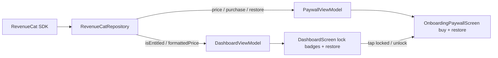

# Payments

## Architecture

## How it works

- **One-time purchase** ($29.99) unlocks all paid `TopicCategory` scenarios
- **Entitlement**: `all_scenarios` — checked via `RevenueCatRepository.isEntitled: StateFlow<Boolean>`
- **Source of truth**: RevenueCat `CustomerInfo` (cached offline, no SharedPreferences needed)
- **Pricing**: Live from RevenueCat offering with `$29.99` fallback

## Key Classes

| Class | Purpose |
|-------|---------|
| `RevenueCatRepository` | SDK wrapper; exposes `isEntitled`, `formattedPrice`, `purchaseState` |
| `PaywallViewModel` | Paywall UI state + purchase/restore actions |
| `DashboardViewModel` | Observes entitlement; handles restore button |

## Purchase Flow

1. Tap locked category → navigate to `Routes.PAYWALL`
2. `PaywallViewModel.purchase(activity)` → `RevenueCatRepository.purchase()`
3. SDK billing flow → success updates `CustomerInfo` → `isEntitled = true`
4. `LaunchedEffect` triggers `onPurchased()` callback

## Restore Flow

- **Dashboard**: "Restore purchase" button → `DashboardViewModel.restorePurchases()`
- **Paywall**: "Restore purchase" text button → `PaywallViewModel.restore()`
- Both call `RevenueCatRepository.restore()` → syncs `CustomerInfo`

## Setup Prerequisites

1. RevenueCat project + Google Play Service Credentials
2. Play Console: managed product `all_scenarios_unlock`
3. RevenueCat: entitlement `all_scenarios` → product → offering
4. Add public SDK key to `BuildConfig.REVENUECAT_API_KEY`
5. Test with signed build + Play license tester
